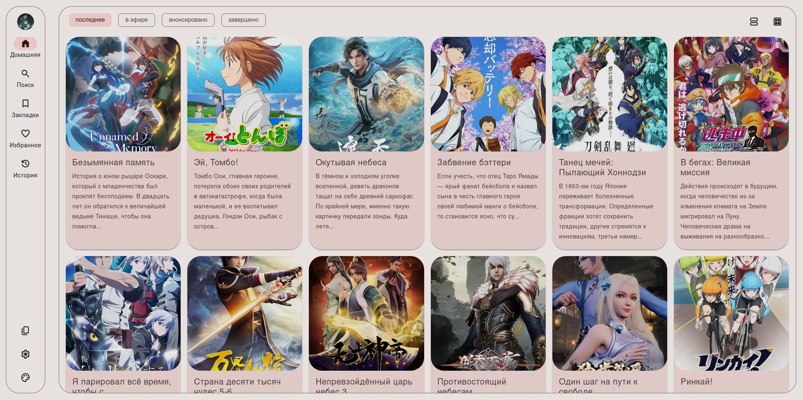

# AniX - Unofficial Web Client for Anixart

AniX is an unofficial web client for the Android application Anixart. It allows you to access and manage your Anixart account from a web browser on your desktop or laptop computer.

## Screenshots

**User profile page**

<details>

| Dark                                                          | Light                                                           |
| ------------------------------------------------------------- | --------------------------------------------------------------- |
|  |  |

</details>

**Pages with releases lists**

<details>

| Dark                                                                   | Light                                                                    |
| ---------------------------------------------------------------------- | ------------------------------------------------------------------------ |
|  |  |
|    |    |

</details>

**Release page and Player**

<details>

| Dark                                                   | Light                                                    |
| ------------------------------------------------------ | -------------------------------------------------------- |
|  |  |

</details>

## Features

1. Dynamic theming (light/dark mode, app colors)
2. login/logout to AnixArt account
3. sync watch history, bookmarks and favorites
4. row or card layout for releases view

## Project Structure

This project consists of two main parts:

1. **Backend (Python with FastAPI):** This handles communication with the Anixart API and provides data to the frontend.
2. **Frontend (Next.js):** This is the user interface that you interact with in your web browser. It fetches data from the backend and displays it in a user-friendly way.

## Disclaimer

Please note that AniX is an unofficial project and is not affiliated with the developers of Anixart. It is recommended to use the official Anixart app for the most up-to-date features and functionality.

## Development

To maintain code formatting it's recommended to use pre-commit hooks

0. Install global pre-commit `pip install pre-commit`
1. Install pre-commit hooks via `pre-commit install` inside repository folder

To maintain readable git commit messages it's recommended to use [commitizen](https://commitizen-tools.github.io/commitizen/)

Feel free to make changes and experiment with the project.

## Getting Started

### Docker

#### Docker Requirements

- docker (>=26)
- docker compose (>= 2.27)

#### Running development project via Docker

Execute `docker compose -f docker-compose.dev.yml up` command in the root of the folder.

You can access the AniX web client in your browser at `http://127.0.0.1`. And API docs at `http://127.0.0.1/api/v1/docs`

#### Running development project via Docker with realtime changes

To run development environment with realtime changes via docker you can execute the docker watch command, it will watch and copy local changes in to the running container. you will need to use the dev compose file and docker files.

Execute the `docker compose -f docker-compose.dev.yml watch` command to set up the docker development environment with realtime changes.

To access the docker logs you can use `docker compose -f docker-compose.dev.yml logs -f` command.

## Deployment

1. clone this repository via `git clone https://github.com/Radiquum/AniX.git`
2. cd into the repository folder.
3. deploy app with below instructions.

### Docker Deployment

#### Docker Prerequisites

1. **Docker:** Make sure Docker is installed on your system. You can download it from [https://www.docker.com/](https://www.docker.com/).
2. **Docker Compose:** Docker Compose should also be installed. It's usually included with Docker installations.
3. **Domain Name:** (optional) You need a registered domain name (e.g., `example.com`) and have it pointing to your server's IP address.
4. **SSL Certificate:** (optional) For HTTPS, you'll need an SSL certificate. Let's Encrypt is a free and popular option.

#### Docker steps

1. Edit the .env file
2. Edit the docker-compose.yml file to match your needs.
3. run `docker compose up -d` to build and run production images.
4. your app will be available at `http(s)://{DOMAIN}`.
5. run `docker compose down` to stop the containers.

*notes*:

- application is deployed as http by default, to enable https you need to edit docker compose and .env files.

   if https is enabled, traefik will automatically issue HTTPS certificate from lets encrypt and redirect to HTTPS.

- you can also run `docker compose up --build` to build and run images without re-deploying the containers.

### Deta Space

1. **Install the Space CLI:**

   ```bash
   curl -fsSL https://deta.space/assets/space-cli.sh | sh
   ```

2. **Login to Deta Space:**

   ```bash
   space login
   ```

   (You'll need to grab an access token from your Space dashboard)

3. **Create a new Space Project:**

   ```bash
   space new
   ```

   (This will guide you through setting up your project)

4. **Push your app to Deta Space:**

   ```bash
   space push --runner-version experimental
   ```

   (This will build and deploy your application)

You can find more details in the Deta Space documentation: [Deta Space Docs](https://docs.deta.space/)

## Contributing

We welcome contributions to this project! If you have any bug fixes, improvements, or new features, please feel free to create a pull request.
